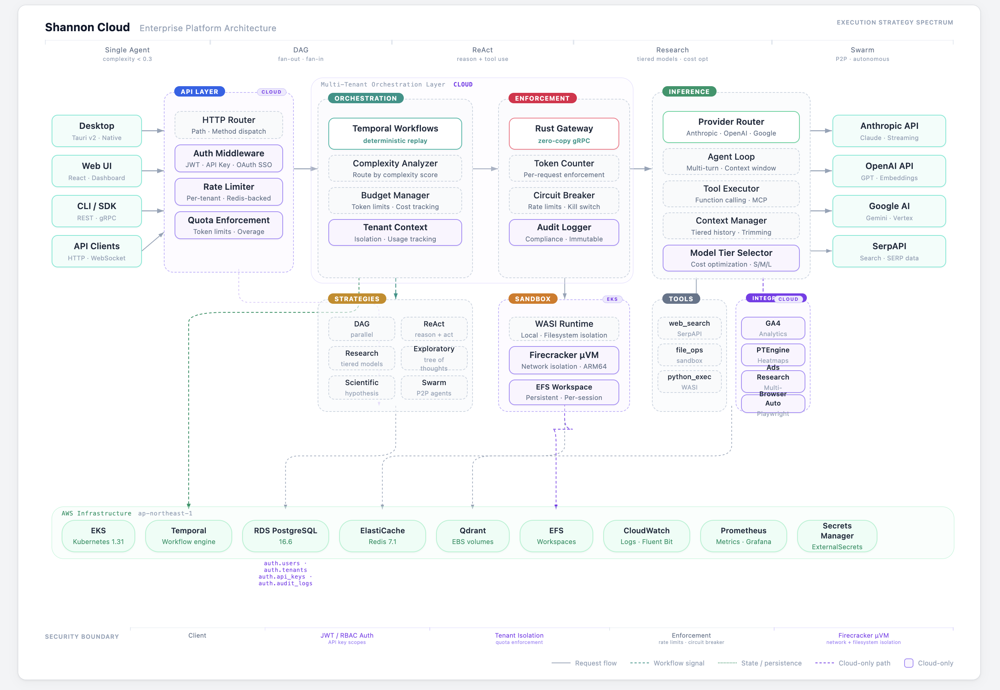

# Shannon — Multi-Agent AI Platform

Shannon is an open-source, enterprise-grade multi-agent AI platform that combines **Rust** (enforcement gateway), **Go** (orchestration with Temporal), and **Python** (LLM services) into a token-efficient, distributed AI system.

<div align="center">



</div>

## Platform Architecture

```
Client --> Gateway (Go) --> Orchestrator (Go) --> Agent Core (Rust) --> LLM Service (Python) --> Providers
             |                    |                      |                      |
             | Auth/Rate limit    | Temporal workflows    | WASI sandbox         | Tool execution
             | Quota enforcement  | Budget management     | Token enforcement    | Agent loop
             |                    | Complexity routing    | Circuit breaker      | Context management
             v                    v                       v                      v
           PostgreSQL          Temporal               Redis/Qdrant           Tool Adapters
```

### Core Services

| Service | Language | Port | Role |
|---------|----------|------|------|
| **Gateway** | Go | 8080 | REST API, auth (JWT/API key), rate limiting, quota enforcement |
| **Orchestrator** | Go | 50052 | Temporal workflows, task decomposition, budget management, complexity routing |
| **Agent Core** | Rust | 50051 | Enforcement gateway, WASI sandbox, token counting, circuit breaker |
| **LLM Service** | Python | 8000 | Provider abstraction (Anthropic, OpenAI, Google, DeepSeek), MCP tools, agent loop |
| **Playwright** | Python | 8002 | Browser automation for web scraping |

### Execution Strategies

Tasks are automatically routed based on complexity:

| Strategy | Trigger | Use Case |
|----------|---------|----------|
| **Simple** | Complexity < 0.3 | Single-agent, direct response |
| **DAG** | Parallel subtasks | Fan-out/fan-in execution |
| **ReAct** | Iterative reasoning | Reasoning + tool use loops |
| **Research** | Multi-step research | Tiered models for cost optimization (50-70% reduction) |
| **Swarm** | Autonomous teams | Lead-orchestrated multi-agent with convergence detection |

### Data Layer

| Component | Purpose |
|-----------|---------|
| **PostgreSQL** | Task executions, sessions, user data |
| **Redis** | Session cache, rate limiting, event pubsub |
| **Qdrant** | Vector memory, semantic search |
| **Temporal** | Workflow state, deterministic replay |

## Quick Start

```bash
make setup-env          # Create .env from template
vim .env                # Add API keys (OPENAI_API_KEY or ANTHROPIC_API_KEY)
make dev                # Start all services via Docker Compose
make smoke              # Run E2E smoke tests
```

### Essential Commands

```bash
make dev                # Start all services
make smoke              # Run E2E smoke tests
make proto              # Regenerate protobuf files
make ci                 # Run CI checks
make logs               # View service logs
```

### Testing

```bash
# Submit a test task
./scripts/submit_task.sh "Your query here"

# Run service-specific tests
cd rust/agent-core && cargo test
cd go/orchestrator && go test -race ./...
cd python/llm-service && python3 -m pytest
```

## API Endpoints

Shannon exposes 4 API entry points:

| Endpoint | Orchestrator? | Format | Use Case |
|----------|:---:|--------|----------|
| `POST /v1/chat/completions` | Yes | OpenAI-compatible | Apps using OpenAI SDK -- auto tool selection, deep research, swarm, strategies |
| `POST /v1/completions` | No (proxy) | OpenAI-compatible | Thin LLM proxy -- single call, no orchestration, caller-supplied tools only |
| `POST /api/v1/tasks` | Yes | Shannon native (sync) | Full orchestrator pipeline, sync response |
| `POST /api/v1/tasks/stream` | Yes | Shannon native (SSE) | Full orchestrator pipeline, streaming SSE events |

`/v1/chat/completions` supports Shannon-specific routing via `shannon_options`:
```json
{
  "model": "...",
  "messages": [...],
  "stream": true,
  "shannon_options": {
    "context": {"force_research": true},
    "research_strategy": "deep"
  }
}
```

### Tool Execution API

Direct tool execution without full task orchestration:
- `GET /api/v1/tools` -- List available tool schemas
- `GET /api/v1/tools/{name}` -- Get tool metadata + parameter schema
- `POST /api/v1/tools/{name}/execute` -- Execute a tool directly

### Skip Auth (Local Development)

```bash
# 1. .env
GATEWAY_SKIP_AUTH=1

# 2. config/shannon.yaml
auth:
  skip_auth: true

# Restart services after changes
docker compose -f deploy/compose/docker-compose.yml restart gateway orchestrator
```

## Project Structure

```
shannon/
├── go/orchestrator/          # Temporal workflows, budget manager, gateway
│   ├── cmd/gateway/          # REST API gateway (auth, rate limiting)
│   └── internal/             # Workflows, strategies, activities
├── rust/agent-core/          # Enforcement gateway, WASI sandbox
├── python/llm-service/       # LLM providers, MCP tools, agent loop
├── protos/                   # Shared protobuf definitions
├── config/                   # YAML configuration files
├── deploy/compose/           # Docker Compose for local dev
├── migrations/               # PostgreSQL schema migrations
├── scripts/                  # Automation and helper scripts
└── docs/                     # Architecture and API documentation
```

### Configuration

| File | Purpose |
|------|---------|
| `.env` | API keys, runtime settings (highest priority) |
| `config/shannon.yaml` | Feature flags, auth, tracing |
| `config/models.yaml` | LLM providers, pricing, capabilities |
| `config/features.yaml` | Workflow settings, execution modes |
| `config/research_strategies.yaml` | Research strategy model tiers |

### Service Ports (Local Development)

| Service | Port | Protocol |
|---------|------|----------|
| Gateway | 8080 | HTTP |
| Orchestrator | 50052 (gRPC), 8081 (health), 2112 (metrics) | gRPC/HTTP |
| Agent Core | 50051 (gRPC), 2113 (metrics) | gRPC |
| LLM Service | 8000 | HTTP |
| Temporal | 7233 (gRPC), 8088 (UI) | gRPC/HTTP |
| PostgreSQL | 5432 | TCP |
| Redis | 6379 | TCP |
| Qdrant | 6333 | HTTP |

## Documentation

- [Multi-Agent Workflow Architecture](docs/multi-agent-workflow-architecture.md)
- [Streaming APIs](docs/streaming-api.md)
- [Pattern Usage Guide](docs/pattern-usage-guide.md)
- [Skills System](docs/skills-system.md)
- [Session Workspaces](docs/session-workspaces.md)
- [Extending Shannon](docs/extending-shannon.md)
- [Adding Custom Tools](docs/adding-custom-tools.md)
- [Swarm Agents](docs/swarm-agents.md)

## License

[MIT License](LICENSE)
